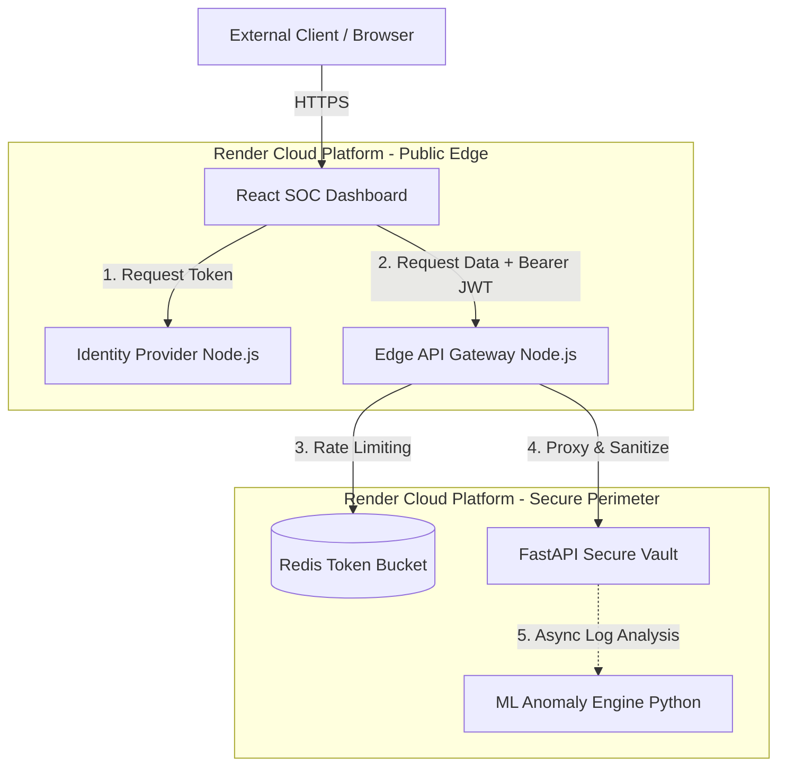

# 🛡️ Enterprise Zero-Trust Command Center (ZTCC) & API Gateway


An enterprise-grade, defense-in-depth security architecture implementing a strict **Zero-Trust Network Access (ZTNA)** model. This monorepo contains a fully deployed cloud ecosystem featuring a high-performance Edge Gateway, an Identity Provider (IdP), a protected FastAPI secure vault, and a modern React-based Security Operations Center (SOC) dashboard.

### 🌐 Live Demo
**Access the Live SOC Dashboard:** [https://five-admin-dashboard.onrender.com](https://five-admin-dashboard.onrender.com)

---

## 🏗️ Architecture & Traffic Flow

This project abandons the traditional "castle-and-moat" security model. No traffic is trusted by default, regardless of its origin. Every request is explicitly authenticated, authorized, and sanitized at the edge.


## ✨ Core Security Implementations

*   **Strict Identity Verification (JWT):** All ingress traffic must possess a cryptographically signed JSON Web Token issued by the dedicated Node.js Identity Provider.
*   **Payload Sanitization Engine:** Deep-object inspection middleware that recursively scrubs incoming JSON payloads and query parameters to block SQL Injection (SQLi) and Cross-Site Scripting (XSS) patterns before they reach the backend.
*   **Distributed Rate Limiting:** Redis-backed token bucket algorithm to mitigate Distributed Denial of Service (DDoS) and brute-force credential stuffing attacks at the edge.
*   **Behavioral Analytics & Concept Drift Detection:** An integrated machine learning engine utilizing `scikit-learn` (Isolation Forest) to ingest access logs, monitor user behavior, and detect concept drift in network intrusion patterns to flag zero-day anomalies.
*   **Automated DevSecOps Pipeline:** GitHub Actions configured for continuous Static Application Security Testing (SAST) via CodeQL and dependency vulnerability auditing.

---

## 📂 Monorepo Structure
```text
.
├── .github/workflows/          # Automated DevSecOps Pipelines (SAST, Audit)
├── infrastructure/
│   ├── tests/                  # k6 Load Testing Scripts
│   └── render.yaml             # Infrastructure as Code (IaC) Blueprint
├── services/
│   ├── 1-api-gateway/          # Node.js Edge Proxy & ZTNA Middleware
│   ├── 2-auth-provider/        # Node.js Identity & Access Management (IdP)
│   ├── 3-backend-api/          # Python/FastAPI Protected Resource Vault
│   ├── 4-security-operations/  # Python ML Concept Drift/Anomaly Engine
│   └── 5-admin-dashboard/      # React + Tailwind v4 SOC UI
└── README.md
```

---

## ☁️ Deployment (GitOps via Render)

This entire multi-tier architecture is deployed automatically via Infrastructure as Code (IaC) using Render Blueprints, configured for free-tier web services.

### How to Deploy Your Own Instance:
1. Fork/Clone this repository.
2. Connect your repository to [Render.com](https://render.com).
3. Create a **New Blueprint** and point it to the `infrastructure/render.yaml` file.
4. Render will automatically spin up the Auth Provider, API Gateway, Python Backend, and React Dashboard.
5. **Final Wiring:** Once deployed, grab the URLs for your new API Gateway and Auth Provider. Add them to your `5-admin-dashboard` environment variables:
   * `VITE_GATEWAY_URL` = `https://your-gateway-url.onrender.com`
   * `VITE_AUTH_URL` = `https://your-auth-url.onrender.com`
6. Trigger a manual **Clear build cache & deploy** on the dashboard to bake in the cloud URLs.

---

## 🚀 Local Development (Codespaces)

This project is configured to run out-of-the-box using GitHub Codespaces with a custom `.devcontainer`.

Open four separate terminal tabs to launch the internal network:
```bash
# Terminal 1: Launch the Identity Provider
cd services/2-auth-provider && npm install && node oauth-issuer.js

# Terminal 2: Launch the Isolated Backend
cd services/3-backend-api && pip install -r requirements.txt && python -m uvicorn app:app --host 0.0.0.0 --port 10000

# Terminal 3: Launch the API Gateway
cd services/1-api-gateway && npm install && node ingress-router.js

# Terminal 4: Launch the SOC Dashboard
cd services/5-admin-dashboard && npm install && npm run dev
```

---
