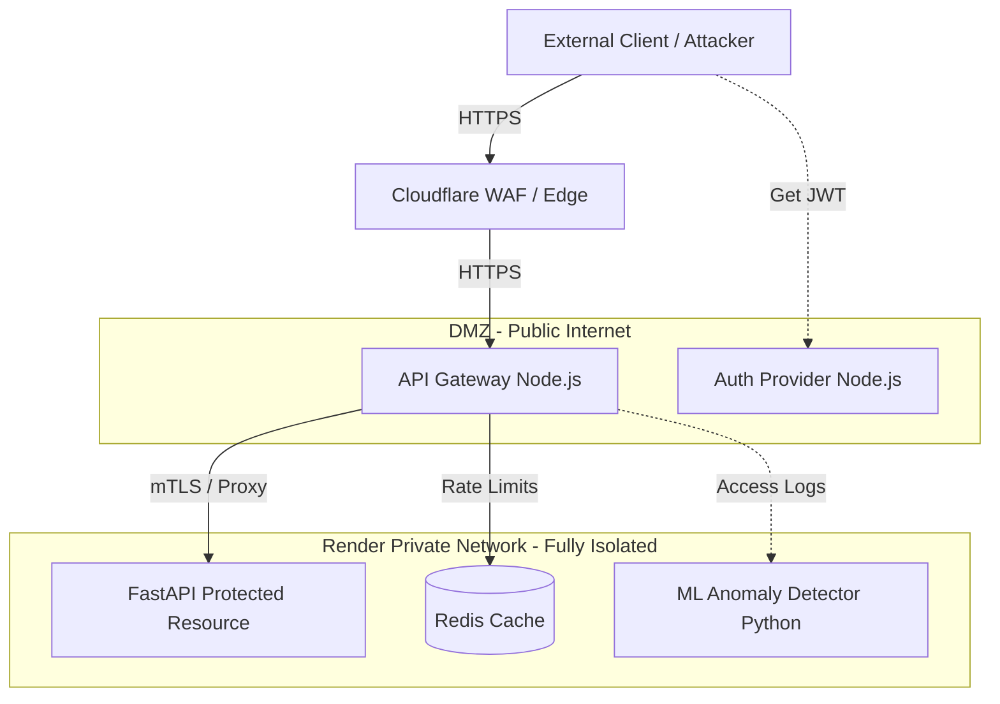

# 🛡️ Enterprise Zero-Trust API Gateway & SOC Dashboard


An enterprise-grade, defense-in-depth security architecture implementing a strict **Zero-Trust Network Access (ZTNA)** model. This monorepo contains a fully isolated cloud ecosystem featuring a high-performance Edge Gateway, an Identity Provider (IdP), an isolated FastAPI backend, Machine Learning anomaly detection, and a React-based Security Operations Center (SOC) dashboard.

---

## 🏗️ Enterprise Architecture

This project abandons the traditional "castle-and-moat" security model. Instead, it assumes the network is inherently hostile. No traffic is trusted by default, regardless of its origin.


## ✨ Core Security Implementations

*   **Strict Identity Verification (JWT):** All ingress traffic must possess a cryptographically signed JSON Web Token with a short time-to-live (TTL).
*   **Payload Sanitization Engine:** Deep-object inspection middleware that recursively scrubs incoming JSON payloads and query parameters to block SQL Injection (SQLi) and Cross-Site Scripting (XSS) patterns.
*   **Distributed Rate Limiting:** Redis-backed token bucket algorithm to mitigate Distributed Denial of Service (DDoS) and brute-force credential stuffing attacks.
*   **Machine Learning Anomaly Detection:** An isolated background worker utilizing `scikit-learn` (Isolation Forest) to ingest access logs and identify behavioral anomalies (Concept Drift) in user access patterns.
*   **Network Isolation:** The Python backend resource possesses no public IP address. It only accepts traffic routed internally from the validated API Gateway via Render's private network.
*   **Automated DevSecOps Pipeline:** GitHub Actions configured for continuous Static Application Security Testing (SAST) via CodeQL and dependency vulnerability auditing.

---

## 📂 Monorepo Structure
```text
.
├── .github/workflows/          # Automated DevSecOps Pipelines (SAST, Audit)
├── infrastructure/
│   ├── tests/                  # k6 Load Testing Scripts
│   ├── policies/               # Open Policy Agent (OPA) Rules
│   └── render.yaml             # Infrastructure as Code (IaC) Blueprint
├── services/
│   ├── 1-api-gateway/          # Node.js Edge Proxy & Security Middleware
│   ├── 2-auth-provider/        # Node.js Identity & Access Management
│   ├── 3-backend-api/          # Python/FastAPI Isolated Vault
│   ├── 4-security-operations/  # Python ML Anomaly Detection Engine
│   └── 5-admin-dashboard/      # React + Tailwind v4 SOC UI
└── README.md
```

---

## 🚀 Quick Start (Local Development)

This project is configured to run out-of-the-box using GitHub Codespaces with a custom `.devcontainer`.

### 1. Boot up the Core Microservices
Open three separate terminal tabs to launch the internal network:
```bash
# Terminal 1: Launch the Isolated Backend
cd services/3-backend-api && python -m uvicorn app:app --host 0.0.0.0 --port 10000

# Terminal 2: Launch the Identity Provider
cd services/2-auth-provider && node oauth-issuer.js

# Terminal 3: Launch the API Gateway
cd services/1-api-gateway && node ingress-router.js
```

### 2. Launch the SOC Dashboard
Open a fourth terminal to spin up the Vite React frontend:
```bash
cd services/5-admin-dashboard
npm install
npm run dev
```

### 3. Run the DDoS Stress Test
To verify the efficiency of the rate limiter, execute the k6 load test:
```bash
k6 run infrastructure/tests/load-test.js
```

---

## ☁️ Deployment (GitOps)

This entire architecture is deployed via Infrastructure as Code (IaC) using Render Blueprints.
1. Connect this repository to your Render account.
2. Render will parse the `infrastructure/render.yaml` file.
3. Render automatically provisions the Redis cache, the isolated private backend, the public gateway, and the static React dashboard, linking them securely via environment variables.

---

## 🛡️ Technical Assurance & Threat Mitigation

| Threat Vector | Mitigation Strategy Implemented |
| :--- | :--- |
| **DDoS Attacks** | Redis-backed global rate limiting (`express-rate-limit`). |
| **Data Breach / Leakage** | Complete removal of public IPs for backend databases and APIs. |
| **SQLi / XSS** | Custom regex-based payload sanitization middleware. |
| **Compromised Credentials** | Short-lived JWTs (15m TTL) + ML Isolation Forest anomaly tracking. |
| **Vulnerable Dependencies** | CI/CD pipeline blocks merges if `npm audit` or `safety check` fails. |

